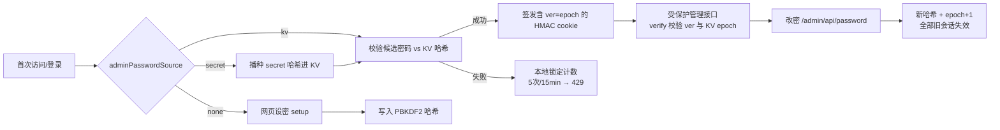

## 产品概述

将本 Worker 的管理员密码机制对齐参考项目 M365-Copilot2API-on-Cloudflare-Worker 的「存储与来源优先级」模型，在保留现有首次自助设密体验（无默认密码、无强制首改）的前提下完成以下功能改造：

## 核心功能

- **KV 单一哈希存储**：管理密码哈希始终存入 KV（`admin:password_hash`，PBKDF2）；`ADMIN_PASSWORD` secret 仅作引导源，首次使用时将其哈希播种进 KV。
- **来源优先级判定**：状态接口上报 `password_source`（`none`/`secret`/`kv`）。判定规则：无 secret 且 KV 空 → `none`（网页自助设密）；有 secret 且 KV 空或 KV 值等于 secret 的哈希 → `secret`；控制台改过密码（KV 值 ≠ secret 哈希）→ `kv`，即改密后覆盖 secret 生效。
- **校验统一走 KV**：无论来源为 secret 还是 kv，登录校验均比对 KV 内有效哈希，删除现有「secret 明文恒等比较优先」分支。
- **控制台改密并踢下线**：新增受保护接口 `POST /admin/api/password`（需登录，提交当前/新密码），成功后写入新哈希、使所有既有管理会话立即失效并需重新登录。
- **登录失败锁定**：同一客户端 IP 15 分钟内失败 5 次即锁定（429 + Retry-After），成功后清除计数，隔离区本地计数（本 Worker 无 Durable Object）。
- 首次访问无任何密码时的网页设密流程、管理后台其余功能、客户端 API Key 鉴权与 `/v1/*` 代理行为保持不变。

## 技术栈

沿用现有项目技术栈：Cloudflare Workers + TypeScript + Workers KV；密码哈希沿用 WebCrypto PBKDF2-SHA256（salt 16B、100k 迭代、base64url）；管理会话沿用无状态 HMAC-SHA256 cookie（`ow2_admin`，TTL 7 天）。不新增依赖、不改 `wrangler.jsonc`（KV 绑定名 `KV`）、不引入 Durable Object / D1。

## 实现思路

以参考项目 `M365-Copilot2API-on-Cloudflare-Worker` 的 `src/store/admin.ts`（`loadAdmin`/`adminPasswordSource`/`changeAdminPassword`）与 `src/admin/handlers.ts`（登录锁定）为蓝本做语义移植，但做三处本地化适配：

1. **无默认密码**：删去 M365 的 `admin123`/`mustChange` 分支；`source === "none"` 时保留现有 `adminNeedsSetup`/网页设密流。
2. **改密全局失效**：本 Worker 会话为无状态 HMAC token，无法像 M365 那样清空 KV 会话表，因此引入 KV 键 `admin:session_epoch`（默认 0）：`createAdminToken` 把当前 epoch 写入 payload `ver`，`verifyAdminToken` 每次直接读 KV 校验 `ver` 一致；改密时 epoch+1，使全部旧 token 失效。管理路径低频，直接 KV 读不设长缓存以保证即时踢下线，免费层配额可接受。
3. **登录锁定**：无 COORD DO，仅实现 M365 `handlers.ts` 中 `localLockoutCheck/Record/Clear` + `clientIP`（`CF-Connecting-IP` 优先、`X-Forwarded-For` 首个 IP 兜底）的隔离区本地 Map 语义：15 min 滚动窗口、5 次阈值、锁至第 5 次失败时刻 +15 min、上限 4096 条先剪过期再逐出最旧。

关键决策：

- 保留 PBKDF2（比 M365 的 SHA-256 hex 更强），不降级；`PasswordHash` 类型不变。
- 保留现有 KV 键名与 60s 实例缓存策略（密码哈希读取本身低频，`session_epoch` 除外不缓存）。
- `adminSetupPassword` 仅允许 `source === "none"` 时调用，现有「secret 已配置/密码已设置」报错文案保留。
- `handleStatus` 的 `adminPasswordMode` 字段语义不变（`none` 驱动 UI 设密视图），改由新 `adminPasswordSource` 计算；同时新增 `passwordSource` 字段便于扩展。

## 数据流



## 实现注意

- **回归控制**：仅触碰管理员密码与会话路径；`verifyClientApiKey`、session 导入、`/v1/*`、KV 键名与 60s 缓存策略、cookie 属性与 7 天 TTL 一律不动。
- **即时失效**：`session_epoch` 的读取不做长缓存（避免改密后旧会话存活），仅管理路径每次多 1 次 KV 读。
- **锁定与日志**：失败仅计数不记密码明文；锁定/清除不打日志刷屏；429 必须带 `Retry-After`。
- **文案**：UI 与报错保持中文；改密成功需引导重新登录（响应清除 cookie + 前端回登录视图）。
- **验证**：`cd worker && npm run typecheck` 通过；`wrangler.jsonc` 不变。

## 目录结构

```
open-webui-to-openai-api-worker/
├── worker/src/
│   ├── types.ts   # [MODIFY] 新增 AdminPasswordSource 类型与注释；Env 注释更新
│   ├── kv.ts      # [MODIFY] 新增 admin:session_epoch 键、getSessionEpoch/bumpSessionEpoch；头部键常量注释更新
│   ├── auth.ts    # [MODIFY] 核心重写：来源判定、secret 播种、统一 KV 校验、改密、token 携带 ver、锁定辅助函数
│   ├── admin.ts   # [MODIFY] login 挂锁定/成功清除、status 用新来源逻辑、新增 /admin/api/password 路由与处理器
│   └── ui.ts      # [MODIFY] panel 新增「修改密码」卡片与前端逻辑（沿用现有样式与全局函数风格）
└── README.md      # [MODIFY] 「设置管理密码」/配置表/安全提示同步新机制
```

## 核心接口（语义约定，不列实现）

- `type AdminPasswordSource = "none" | "secret" | "kv"`
- `adminPasswordSource(env): Promise<AdminPasswordSource>`：空 secret 时 KV 有哈希→`kv`、否则 `none`；KV 空且 secret 非空→`secret`；否则以 PBKDF2 `verifyPassword(secret, storedHash)` 判定 `secret`/`kv`。
- `ensurePasswordSeeded(env): Promise<void>`：KV 空且 secret 非空时写入 `hashPassword(secret)`（来源仍视 `secret`）。
- `adminVerifyPassword(env, password): Promise<boolean>`：先播种，再统一与 KV 哈希比对。
- `adminChangePassword(env, current, next): Promise<void>`：校验当前密码与新密码规则（≥8 位、不得与当前相同），写新哈希并 bump epoch；非法时抛错交由处理器返回中文提示。
- `createAdminToken`/`verifyAdminToken`：payload 增加 `ver`（epoch）；`verifyAdminToken` 以 KV 当前 epoch 校验（含 exp）。
- 锁定辅助：`lockoutCheck(ip)` / `lockoutRecord(ip)` / `lockoutClear(ip)`（隔离区 Map，常量：窗口 15 min、阈值 5、上限 4096）。

## Agent Extensions

### Skill

- **workers-best-practices**
- Purpose: 在实现后审查 auth/kv/admin 改动是否符合 Cloudflare Workers 生产实践（全局状态、KV 读写模式、并发/失效语义），重点核对 session_epoch 失效与本地锁定的正确性
- Expected outcome: 识别并修正潜在的 Worker 反模式，确认最终代码通过 `npm run typecheck` 且无运行时隐患