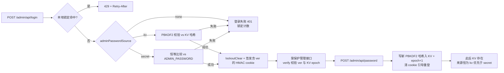

## 产品概述

将本 Worker 的管理员密码机制对齐参考项目 M365-Copilot2API-on-Cloudflare-Worker 的「存储与来源优先级」模型，并按用户的最终修正确定 secret 处理方式，在保留现有首次自助设密体验（无默认密码、无强制首改）的前提下完成改造。

## 核心功能

- **secret 直验不落 KV**：部署配置了 `ADMIN_PASSWORD` 且 KV 无哈希时，登录仅做输入与 secret 的恒等比较（`timingSafeEqualStr`），状态来源显示 `secret`，全程不向 KV 写入任何内容。
- **KV 与 secret 并存时 KV 优先**：一旦 KV 中存在密码哈希（仅来自网页自助设密或管理页改密两处），登录校验一律比对 KV 内 PBKDF2 哈希、忽略 secret 绑定，状态来源显示 `kv`。
- **来源判定**：状态接口上报 `password_source`：KV 有哈希→`kv`；无 KV 且 secret 非空→`secret`；两者皆无→`none`（网页设密视图，逻辑与现有 `adminPasswordMode==='none'` 兼容）。
- **校验顺序对调**：`adminVerifyPassword` 改为「KV 哈希（PBKDF2）在前、secret 明文兜底、皆无则失败」，删除现有 secret 优先分支，且不做任何播种动作。
- **管理页改密并全局踢下线**：新增受保护接口 `POST /admin/api/password`（需登录，提交当前/新密码），成功后写入新哈希、使所有既有管理会话立即失效并需重新登录（无论当前来源是 secret 还是 kv 均可改密）。
- **登录失败锁定**：同一客户端 IP 15 分钟内失败 5 次即锁定（429 + Retry-After），成功后清除计数；隔离区本地计数（本 Worker 无 Durable Object）。
- 首次访问无任何密码时的网页设密流程、管理后台其余功能、客户端 API Key 鉴权与 `/v1/*` 代理行为保持不变。

## 技术栈

沿用现有项目技术栈：Cloudflare Workers + TypeScript + Workers KV；密码哈希沿用 WebCrypto PBKDF2-SHA256（salt 16B、100k 迭代、base64url，`PasswordHash` 类型不变）；管理会话沿用无状态 HMAC-SHA256 cookie（`ow2_admin`，TTL 7 天）。不新增依赖、不改 `wrangler.jsonc`（KV 绑定名 `KV`）、不引入 Durable Object / D1。

## 实现思路

以参考项目 `M365-Copilot2API-on-Cloudflare-Worker` 的 `src/store/admin.ts`（`adminPasswordSource` / `changeAdminPassword` 语义）与 `src/admin/handlers.ts`（登录失败锁定）为蓝本，做三处本地化适配：

1. **secret 直验、永不播种**（用户最终修正）：`adminPasswordSource` 判定规则为 KV 有哈希→`kv`、KV 空且 secret 非空→`secret`、否则→`none`；不比较 KV 值是否等于 hash(secret)（secret 从不写入 KV，无需也无从比较）。`adminVerifyPassword` 对调现有分支：KV 哈希存在→`verifyPassword(pw, stored)`（PBKDF2）；否则 secret 非空→`timingSafeEqualStr(pw, secret)`；否则 false。删去计划初版「secret 引导播种 ensurePasswordSeeded」逻辑，验证路径零 KV 写入。
2. **改密全局失效**：本 Worker 会话为无状态 HMAC token，无法像 M365 那样清空 KV 会话表，因此引入 KV 键 `admin:session_epoch`（默认 0）：`createAdminToken` 把当前 epoch 写入 payload `ver`，`verifyAdminToken` 每次直接读 KV 校验 `ver` 一致（含现有 exp 校验）；改密时 epoch+1，全部旧 token 立即失效。管理路径低频，`session_epoch` 不设长缓存以保证即时踢下线，免费层配额可接受。
3. **登录锁定**：无 COORD DO，仅实现 M365 `handlers.ts` 中 `localLockoutCheck/Record/Clear` + `clientIP`（`CF-Connecting-IP` 优先、`X-Forwarded-For` 首个 IP 兜底）的隔离区本地 Map 语义：15 min 滚动窗口、5 次阈值、锁至第 5 次失败时刻 +15 min、上限 4096 条（先剪过期再逐出最旧）、成功清除。

关键决策：

- `adminChangePassword(env, current, next)`：`adminVerifyPassword(current)` 通过后校验 next（≥8 位、不得与 current 相同）→ `setPasswordHash(hashPassword(next))` → `bumpSessionEpoch`；处理成功由响应清除 cookie，前端引导重新登录。改密后 KV 已存在，后续来源恒为 `kv`，secret 绑定进入休眠（与「KV 优先」一致）。
- `adminSetupPassword` 仅允许 source=none 时调用，现有「secret 已配置/密码已设置」报错文案保留。
- `handleStatus` 的 `adminPasswordMode` 字段语义不变（`none` 驱动 UI 设密视图），改由新 `adminPasswordSource` 计算；同时新增 `passwordSource` 字段。
- 保留现有 KV 键名与 60s 实例缓存策略（密码哈希读取低频，`session_epoch` 除外不缓存）。

## 数据流



## 实现注意

- **回归控制**：仅触碰管理员密码与会话路径；`verifyClientApiKey`、session 导入、`/v1/*`、KV 键名与 60s 缓存策略、cookie 属性与 7 天 TTL、PBKDF2 算法与 `PasswordHash` 一律不动。
- **零播种约束**：验证路径不得出现任何 KV 写入；secret 场景 `getPasswordHash` 只读一次。
- **即时失效**：`session_epoch` 读取不做长缓存（避免改密后旧会话存活）；管理路径每请求多 1 次 KV 读，免费层配额可接受。
- **锁定与日志**：失败仅计数不记录密码明文；锁定/清除不打日志刷屏；429 必须带 `Retry-After`。
- **文案**：UI 与报错保持中文；改密成功需引导重新登录（响应清除 cookie + 前端回登录视图）。
- **验证**：`cd worker && npm run typecheck` 通过；`wrangler.jsonc` 不变。

## 目录结构

```
open-webui-to-openai-api-worker/
├── worker/src/
│   ├── types.ts   # [MODIFY] 新增 AdminPasswordSource 类型与注释；Env 注释更新
│   ├── kv.ts      # [MODIFY] 新增 admin:session_epoch 键、getSessionEpoch/bumpSessionEpoch；头部键常量注释更新
│   ├── auth.ts    # [MODIFY] 核心重写：source 判定(KV>secret>none)、验证对调(KV 优先、无播种)、adminChangePassword、token 携带/校验 ver、本地锁定辅助
│   ├── admin.ts   # [MODIFY] login 挂锁定/成功清除、status 用新来源逻辑并返回 passwordSource、新增 /admin/api/password 路由与处理器
│   └── ui.ts      # [MODIFY] panel 新增「修改密码」卡片与前端逻辑（沿用现有样式与全局函数风格）
└── README.md      # [MODIFY] 「设置管理密码」/配置表/安全提示同步新机制
```

## 核心接口（语义约定）

- `type AdminPasswordSource = "none" | "secret" | "kv"`
- `adminPasswordSource(env): Promise<AdminPasswordSource>`：KV 哈希存在→`kv`；KV 空且 secret 非空→`secret`；否则→`none`（无任何哈希比较或写入）。
- `adminVerifyPassword(env, password): Promise<boolean>`：KV 哈希→PBKDF2 校验；否则 secret→恒等比较；否则 false。
- `adminChangePassword(env, current, next): Promise<void>`：校验当前密码与新密码规则（≥8 位、不得与当前相同），写新哈希并 bump epoch；非法抛错由处理器转中文提示。
- `createAdminToken`/`verifyAdminToken`：payload 增加 `ver`（epoch）；`verifyAdminToken` 以 KV 当前 epoch 校验（含 exp）。
- `getSessionEpoch(env)`/`bumpSessionEpoch(env)`：KV 直接读写，不设实例缓存。
- 锁定辅助：`lockoutCheck(ip)`/`lockoutRecord(ip)`/`lockoutClear(ip)` + `clientIP(request)`（隔离区 Map；窗口 15 min、阈值 5、上限 4096）。

## Agent Extensions

### Skill

- **workers-best-practices**
- Purpose: 在实现后审查 auth/kv/admin 改动是否符合 Cloudflare Workers 生产实践（全局状态、KV 读写模式、并发/失效语义），重点核对 `session_epoch` 失效、本地锁定与「验证零 KV 写入」约束的正确性
- Expected outcome: 识别并修正潜在的 Worker 反模式，确认最终代码通过 `npm run typecheck` 且无运行时隐患