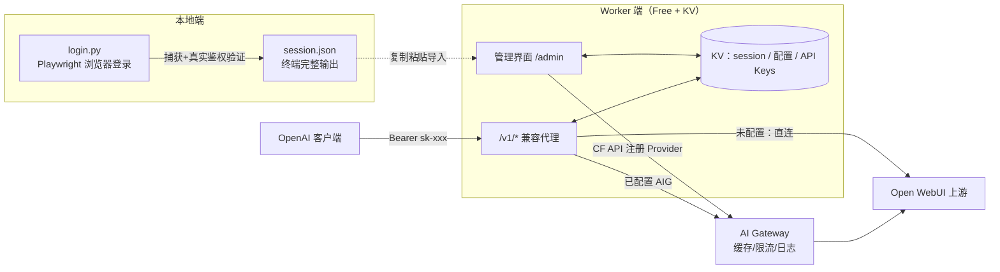

## 产品概述

将“把仅限浏览器登录的 Open WebUI 反代为 OpenAI 兼容接口”的能力迁移为云端双端服务：本地认证工具负责获取登录凭证，云端 Worker 负责对外提供 API 与管理后台。

## 核心功能

### 本地认证获取端

- 启动后打开浏览器窗口，用户手动完成 Open WebUI 登录
- 自动捕获登录后的身份凭证，并向真实服务端验证有效性（防止误抓过期凭证或门户跳转产生的无效凭证）
- 验证通过后将 session.json 完整内容输出到终端，供复制粘贴

### Worker 端 - 网页管理界面（中文）

- 管理员密码登录：支持部署时预设密码或首次访问时设置密码
- 状态总览：凭证导入状态、上游地址、凭证摘要（脱敏显示）、API 接入地址
- 粘贴导入 session.json 内容：格式校验、上游连通性测试、一键保存
- Cloudflare 配置：填写 API Key 等信息后，一键在 AI Gateway 中注册自定义服务端（获得响应缓存、限流、日志统计以节省资源）
- API Key 管理：生成、命名、查看列表（创建时间/最近使用/前缀）、删除；完整 Key 仅创建时显示一次

### Worker 端 - OpenAI 兼容接口

- 提供模型列表、对话补全（含流式输出）、向量嵌入及未实现路径的兜底透传
- 客户端使用生成的 API Key 访问；服务端替换为 Open WebUI 登录凭证后转发上游
- 自动适配上游版本（新旧 API 前缀探测与回退）；上游凭证失效时明确提示重新导入
- 已配置 AI Gateway 时经其转发，未配置时直连上游

### 视觉效果

管理界面为现代深色控制台风格，卡片式分区布局，橙色强调色点缀，含状态徽章、加载反馈、复制按钮等微交互。

## 技术栈

| 端 | 技术 | 说明 |
| --- | --- | --- |
| 本地认证获取端 | Python 3.9+ / Playwright | 复用原项目 `session_store.py` 已验证的登录捕获逻辑 |
| Worker 端 | TypeScript + Cloudflare Workers（原生 fetch handler，零框架依赖） | 路由为简单前缀匹配，免费层 CPU 占用最小化 |
| 存储 | Workers KV（免费层：100k 读/天、1k 写/天） | 不使用 D1 / Durable Objects，纯 KV 满足需求 |
| AI Gateway | Custom Providers API（已检索官方文档验证） | `POST /accounts/{id}/ai-gateway/custom-providers`，路由 `gateway.ai.cloudflare.com/v1/{account}/{gateway}/custom-{slug}/{path}` |
| 构建/部署 | Wrangler（内置 esbuild） | `wrangler.jsonc` 配置 KV 绑定 |


## 实现方案

### 总体策略

双端拆分：本地端只保留“登录捕获 + 终端输出”（从原项目精简 FastAPI 部分）；Worker 端承接“OpenAI 兼容代理 + 管理后台”，代理路径与原项目行为对齐（前缀探测回退、模型规范化、SSE 流式、OpenAI 错误体、凭证失效提示）。

### 关键技术决策

1. **AI Gateway 可选接入**：`config:cloudflare.enabled` 为 true 时上游 base 为 `https://gateway.ai.cloudflare.com/v1/{account_id}/{gateway_id}/custom-{slug}`（附 `cf-aig-authorization` 头）；否则直连 `session.base_url`。AIG 模式下非流式请求可附 `cf-aig-cache-ttl`（流式不支持缓存，文档已确认）。
2. **Custom Provider 注册**：管理界面“一键接入”时：gateway_id 为空则先 `POST /ai-gateway/gateways` 创建；再创建 custom provider（`base_url` = session 的上游根域名，slug 默认 `open-webui`，409 冲突时 PATCH 更新）；最后经 AIG URL 请求上游 `/api/v1/models` 验证连通。
3. **API Key 校验 O(1)**：KV 键直接用 Key 明文 `apikey:{key}` → 元数据，避免遍历；列表用 `KV.list({prefix})`。Key 格式 `sk-` + 48 位随机字符（`crypto.getRandomValues` + base64url）。
4. **免费层 KV 读优化**：session / cloudflare 配置在 Worker 实例全局变量缓存 60s（代理路径每次请求仅需 1 次 KV 读做 API Key 校验 + 可能 0 次配置读），100k 读/天足够。
5. **管理员鉴权双模式**：`env.ADMIN_PASSWORD`（wrangler secret）优先；否则读 KV `admin:password_hash`（PBKDF2 via WebCrypto，首次网页设置）。登录成功签发 HMAC 签名 token（含过期时间戳）存 HttpOnly Cookie，`SESSION_SECRET` 未设置时自动派生存 KV。
6. **流式转发**：`fetch` 上游 → 剥离 hop-by-hop 头 → `new Response(upstream.body, ...)` 直通，CPU 消耗极低；客户端断开由运行时自动取消上游连接。
7. **安全**：所有比较使用 timing-safe 逻辑；日志/界面仅输出凭证前缀与长度（沿用原项目 `describe()` 脱敏策略）；CF API Token 仅存 KV 不入日志；管理 API 全部要求会话 cookie。

### 数据流



## 实现注意事项

- AIG custom provider 的 `base_url` 只填根域名（如 `https://chat.example.com`），`/api/v1/...` 路径放在请求 URL 中，避免文档指出的 `/v1/v1/` 双拼错误；`custom-{slug}` 前缀不可遗漏。
- 上游 401/403 统一映射为 `code=upstream_unauthorized`，错误信息提示“到管理界面重新导入 session”。
- 前缀探测结果（`/api/v1` 或 `/api`）缓存在实例内存，404 时自动回退另一候选（移植 `upstream.py` 逻辑）。
- 兜底透传 `/v1/{path}` 时须剥离客户端 `Authorization` 后注入上游凭证头，并透传客户端 `Content-Type`。
- 模型列表规范化：兼容 `{data|items|models}` 与裸列表，收敛为 `{id, object, created, owned_by}`（移植 `app.py` 的 `normalize_model/extract_model_list`）。
- KV 写集中在管理操作（免费层 1k 写/天足够）；`last_used` 更新用 `ctx.waitUntil` 异步写入并做节流（如 10 分钟一次），避免写放大。
- 管理界面 HTML 内嵌于 `ui.ts`（单文件导出字符串），无外部资源依赖，确保 Worker 自包含。

## 目录结构

```
open-webui-to-openai-api-worker/
├── worker/                              # Cloudflare Worker 端
│   ├── src/
│   │   ├── index.ts                     # [NEW] 入口：fetch handler + 路由分发（/、/admin、/admin/api/*、/v1/*、/healthz）
│   │   ├── types.ts                     # [NEW] 共享类型：Env、StoredSession、CloudflareConfig、ApiKeyMeta
│   │   ├── kv.ts                        # [NEW] KV 数据层：键定义、读写封装、实例级内存缓存（60s TTL）、apikey 列表（list prefix）、密码哈希存取
│   │   ├── auth.ts                      # [NEW] 管理员鉴权（ADMIN_PASSWORD/KV 双模式、PBKDF2、HMAC 会话 token、HttpOnly Cookie）+ /v1 API Key 校验（Bearer/X-API-Key，明文键 O(1) 查询）
│   │   ├── ai-gateway.ts                # [NEW] Cloudflare API 客户端：创建/查询 Gateway、创建/更新 Custom Provider（409→PATCH）、AIG 上游 URL 构造、连通性测试
│   │   ├── proxy.ts                     # [NEW] OpenAI 兼容代理：/v1/models（规范化）、/v1/chat/completions（SSE 流式）、/v1/embeddings、/v1/{path} 兜底透传；前缀探测回退、凭证头注入、hop-by-hop 剥离、OpenAI 风格错误体、401/403 凭证失效提示
│   │   ├── admin.ts                     # [NEW] 管理 API：login/setup/logout、status 总览、session 导入（解析+校验+可选测试）、cloudflare 配置存取、ai-gateway 一键接入、API Key CRUD
│   │   └── ui.ts                        # [NEW] 管理界面单页 HTML（内联 CSS/JS，中文，深色控制台风格，登录视图 + 管理面板视图）
│   ├── wrangler.jsonc                   # [NEW] 配置：name、main、compatibility_date、KV 绑定 O2W_KV
│   ├── package.json                     # [NEW] devDeps：wrangler、typescript、@cloudflare/workers-types
│   └── tsconfig.json                    # [NEW] TS 配置（types: @cloudflare/workers-types）
├── local/                               # 本地认证获取端
│   ├── login.py                         # [NEW] 主入口：移植原 perform_browser_login（is_login_signal 判定、静默观察期、_credentials_are_valid 真实验证、_enrich_from_browser 补充抓取）→ 保存 session.json → 终端分隔线内完整打印 JSON；CLI 参数 --base-url/--timeout/--headless
│   ├── requirements.txt                 # [NEW] playwright
│   └── README.md                        # [NEW] 使用说明（安装、运行、输出复制指引）
├── README.md                            # [NEW] 总体文档：架构图、部署步骤（wrangler login、KV 创建、deploy、secret 设置）、本地端使用、客户端接入示例
└── 参考原项目代码：open-webui-to-openai-api/  # 保持不动
```

## 关键代码结构

```typescript
// worker/src/types.ts
export interface Env {
  O2W_KV: KVNamespace;        // KV 绑定：session / config:cloudflare / apikey:* / admin:password_hash
  ADMIN_PASSWORD?: string;    // 可选：wrangler secret 预设管理密码（优先于 KV）
  SESSION_SECRET?: string;    // 可选：会话 HMAC 签名密钥（未设则自动派生存 KV）
}

export interface StoredSession {   // KV key: "session"
  authorization: string;           // "Bearer eyJ..."（与 cookie 至少一项）
  cookie: string;
  user_agent: string;
  captured_at: number;             // epoch 秒
  base_url: string;                // https://chat.example.com（直连模式的上游根域名）
}

export interface CloudflareConfig { // KV key: "config:cloudflare"
  api_token: string;               // CF API Token（需 AI Gateway Edit 权限）
  account_id: string;
  gateway_id: string;              // 留空时一键接入自动创建
  provider_slug: string;           // 默认 "open-webui"，AIG 路径为 custom-{slug}
  cache_ttl: number;               // 非流式请求 cf-aig-cache-ttl 秒数（0=禁用）
  enabled: boolean;                // true=经 AI Gateway 转发，false=直连上游
}
```

## 设计方案

管理界面为内嵌 Worker 的自包含单页应用（无外部依赖，适配 Workers 免费层），桌面优先、响应式兼容移动端。整体采用现代深色控制台风格（Glassmorphism 卡片 + Cloudflare 品牌橙色点缀），视觉层级清晰，突出状态与操作。

### 页面一：登录页（/admin 未登录态）

- **居中玻璃卡片**：服务 Logo 图形 + 标题“Open WebUI 代理控制台”，半透明磨砂背景卡片悬浮于深色渐变底之上
- **密码表单块**：密码输入框（可见性切换）+ 登录按钮（橙色渐变，hover 微上浮），回车提交
- **首次设置模式块**：检测到未设密码时切换为“设置管理密码 + 确认密码”双输入框，含强度提示
- **反馈区**：错误信息以红/黄色横幅展示，登录按钮含 loading 转圈态

### 页面二：管理面板（登录态，单页多卡片）

- **顶部导航栏**：左侧 Logo + 服务名，右侧当前接入 URL（一键复制）、登出按钮；下方细橙色渐变分隔线
- **状态总览卡片**（四格横排徽章）：Session 状态（已导入/缺失，显示凭证摘要脱敏与导入时间）、上游地址、AI Gateway 状态（已接入/未接入/直连）、API Key 数量；异常项带彩色状态点脉冲动画
- **Session 导入卡片**：说明文字（指引从本地端复制 JSON）、等宽字体多行粘贴框、“校验并测试连通”按钮、“导入”主按钮；成功后显示绿色确认与凭证摘要
- **Cloudflare / AI Gateway 配置卡片**：表单（API Token 密码框、Account ID、Gateway ID 占位提示“留空自动创建”、Provider Slug、缓存 TTL、启用开关）；“一键接入 AI Gateway”按钮展示分步进度（创建 Gateway → 注册 Provider → 连通测试）；接入后显示 AIG 转发 URL
- **API Key 管理卡片**：生成区（名称输入 + “生成 Key”按钮，创建成功弹出完整 Key 一次性展示框含复制按钮）；列表区（表格：名称/前缀/创建时间/最近使用/删除按钮，删除需二次确认）
- **页脚块**：版本号、客户端接入提示（Base URL + Header 示例代码片段，一键复制）

### 交互与动效

卡片入场渐次上浮淡入；按钮 hover 缩放与阴影变化；状态徽章脉冲动画；所有异步操作有 loading 与结果反馈；Toast 轻提示替代弹窗打断。

## Agent Extensions

### Skill

- **cloudflare**
- 用途：实现 Worker 端时检索 Cloudflare 官方文档，确认 Workers/KV/AI Gateway 的 API 签名、请求头（cf-aig-authorization / cf-aig-cache-ttl）与免费层限制
- 预期结果：Worker 代码基于最新准确的平台行为实现，AIG Custom Provider 注册与转发链路一次跑通
- **wrangler**
- 用途：生成正确的 wrangler.jsonc（KV 绑定、compatibility_date）、部署命令序列与 secret 设置指引
- 预期结果：项目可通过 wrangler 直接部署，KV namespace 创建与绑定配置无误
- **workers-best-practices**
- 用途：审查 Worker 代理代码（流式转发、全局状态缓存、secret 处理、异常兜底）是否符合生产最佳实践
- 预期结果：识别并规避常见反模式（如流式处理中的缓冲陷阱、全局状态误用）